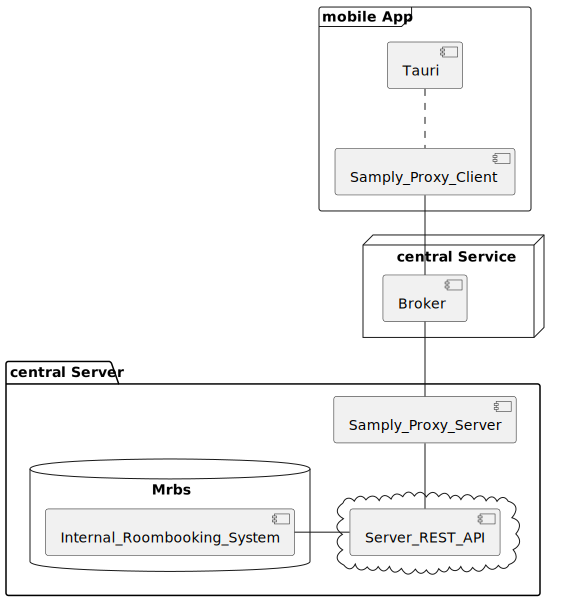

# Examen project Real-Time Room Booking and Occupancy

show case with out [Samply.Beam](https://github.com/samply/beam)

## Examen project

"Raumbelegungssoftware über Samply.Beam"

- Backend-Connector SeaORM (Rust Object Related Mapper)
- Library from the Tokio developer group

- [Dokumentation] will follow

### Tauri framework Extension

- Tauri for building lightweight, secure desktop applications using
  web technologies
- Backend(Rust) with a beam proxy combined
- Frontend(Svelte.js, typescript)
- Desktop app for Windows, Linux and Mac
- [Overview](examen_docu/overview.md)

# Tauri + SvelteKit
